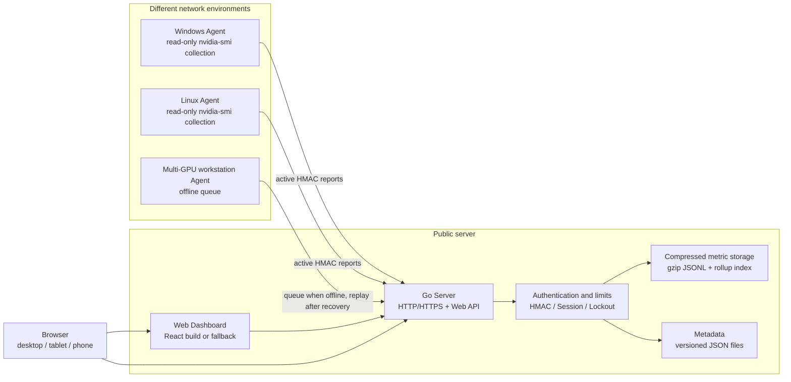
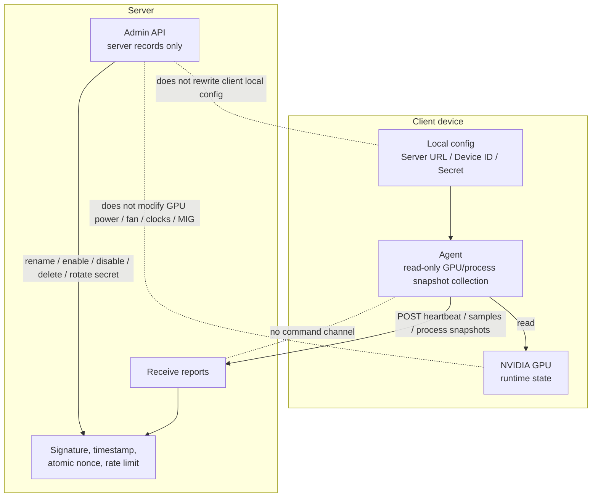
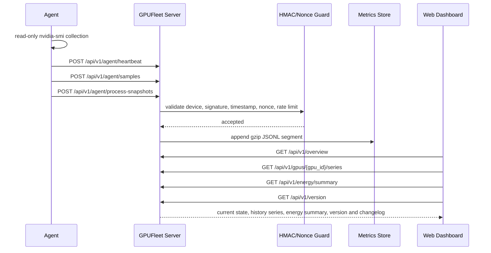
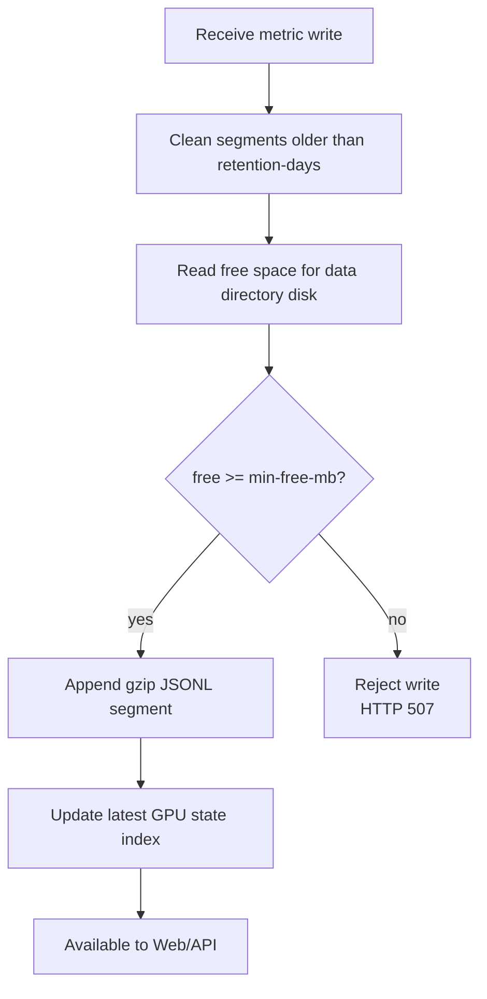
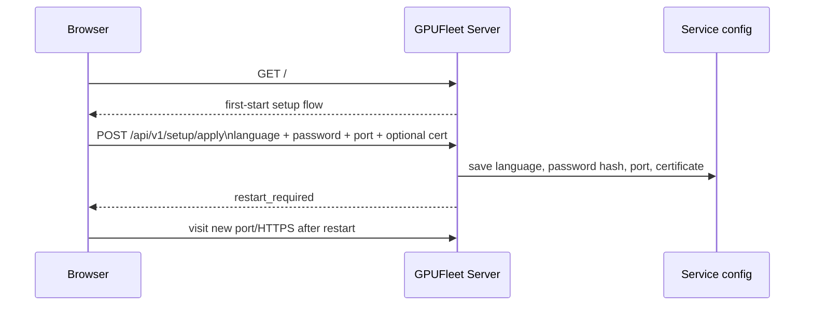
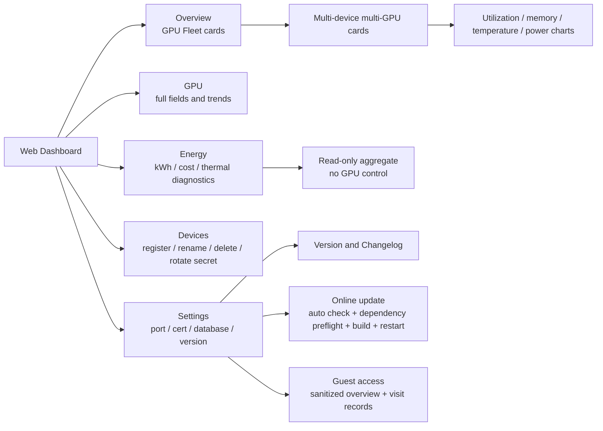
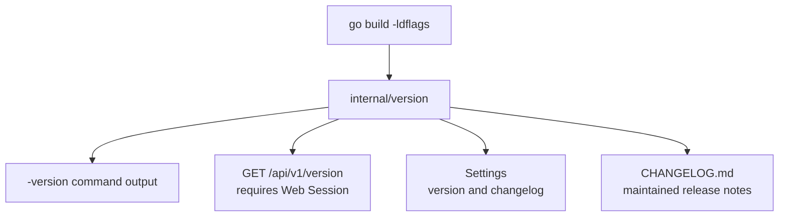
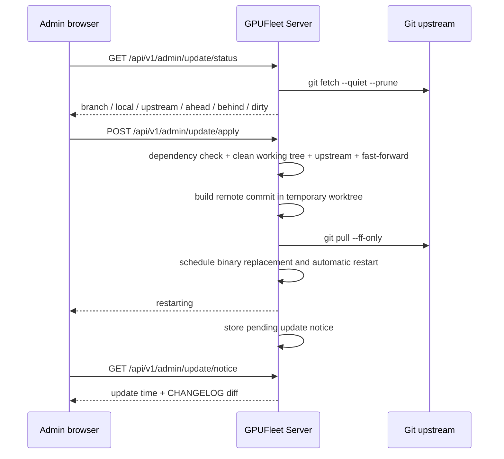

<h1>
  
  GPUFleet
</h1>

[](https://deepwiki.com/stlin256/GPU-Fleet/)
[](https://github.com/stlin256/GPU-Fleet/releases/latest)
[](https://gpufleet-telemetry.stlin256.workers.dev/summary)

GPUFleet is an operations and observability dashboard for NVIDIA GPU machines spread across home broadband, offices, cloud hosts, or remote rooms. A public server receives read-only reports from Windows/Linux devices and shows whether each GPU is busy, how its recent utilization changed, which devices went offline, which GPUs need temperature or PCIe attention, and which processes are currently using GPU memory.

The product stays intentionally direct: the server handles login, device management, storage, statistics, diagnostics, backup, and online update; every device runs a local read-only Agent that actively reports GPU metrics, optional process snapshots, and configuration snapshots. The server never connects back to clients, sends commands, edits Agent configuration, kills processes, or changes GPU settings. Optional Agent update is also a client pull model: the Agent downloads a signed manifest and verified artifact, then replaces only its own binary.

Chinese documentation: [README.md](README.md)<br>
Installation guide: [docs/14-installation.md](docs/14-installation.md)<br>

## What It Does

- Fleet overview: multi-host, multi-GPU cards with online state, utilization, memory, temperature, power, PCIe state, clock throttle reasons, and process summaries. Offline devices have a clear overlay, and GPUs from the same device share the same border color for fast scanning.
- History: each GPU card includes 2x2 trend charts for utilization, memory, temperature, and power, with hover readings. Statistics support 1H, 6H, 24H, 7D, and 30D ranges backed by rollup indexes.
- Energy view: derives 24H, 7D, and 30D kWh, cost estimates, thermal trends, per-GPU energy ranking, high-idle-power, throttle, and thermal diagnostics from existing read-only metrics. It does not issue power, fan, or clock controls.
- Device management: create devices, copy one-time secrets, rename, enable/disable, delete, and rotate secrets from the web dashboard. These actions only change server-side authentication records and never rewrite Agent local configuration.
- Server management: first startup lets the browser choose language, password, port, and optional HTTPS certificate. Settings can change password, language, port, certificate, disk reserve, server automatic update, Agent update policy, update proxy, and legacy Agent compatibility.
- Operations: the server can download the database and export either a standard or advanced read-only diagnostics package. The standard package is for routine troubleshooting; the advanced package adds redacted Agent configuration reports, process snapshots, guest records, web session timing summaries, and metric segment listings. Linux deployments include backup/restore scripts. Online update validates official upstream source, upstream binding, clean worktree, fast-forward path, and exact target commit, then builds before pulling and restarting.
- Guest access: optional `/guest` sanitized overview for read-only visitors. Guests cannot see processes, statistics, real device IDs, hostnames, Agent metadata, driver versions, GPU UUIDs, VBIOS, or admin APIs.
- Lightweight deployment: the default stack is one Go server, one Go Agent, React static files, gzip JSONL metric segments, and JSON metadata. Prometheus, Grafana, and external databases are not required.
- Ecosystem signal: anonymous aggregate telemetry is enabled by default and only reports deployment version, server platform, active Agent count, and active GPU count for the README GPU badge. It never uploads hostnames, device IDs, GPU UUIDs, processes, usernames, secrets, or access URLs.

## Current Status

GPUFleet is currently at `1.0.15`. The core reporting path, dashboard, device management, guest access, long-range statistics, read-only energy and thermal visibility, online update, signed Agent self-update policy, anonymous aggregate telemetry, standard/advanced diagnostics packages, backup/restore scripts, and browser-level frontend smoke verification are implemented. VictoriaMetrics, SQLite, configurable alert rules, CSV export, and SSE live refresh remain planned enhancements.

## Product Screenshots


## Architecture



## Security Boundary

GPUFleet's security boundary is part of the product design: the server cannot affect client settings and cannot remotely execute client actions.



## Data Flow



## Storage And Disk Protection

The default deployment does not require an external database. The server stores time-series metrics in compressed segment files and metadata in JSON files. Before each write, it removes segments older than the retention window and checks free space on the data directory disk. If free space is below the configured threshold, new metric writes are rejected to avoid filling the disk.



Default parameters:

| Parameter | Default | Description |
| --- | --- | --- |
| `-retention-days` | `30` | Compressed metric segment retention days |
| `-min-free-mb` | `800` | Minimum free space preserved before writes |
| `-data-dir` | `data` | Server runtime data directory |
| `-web-dir` | `web/dist` | React build directory |
| `-repo-dir` | `.` | Server Git checkout used for online update checks |

## First Startup

On first startup, the server uses the startup listen port and HTTP. The first browser visit opens the setup flow: choose interface language, then configure access password, next startup port, and optional HTTPS certificate.



After login, Settings can also change language or reopen the setup flow to adjust password, port, language, and certificate together. Language changes apply immediately; port and HTTPS certificate changes fully apply after restarting the current server process.

## Quick Run

### Build

Windows PowerShell:

```powershell
$env:GOCACHE='F:\project\GPUFleet\.gocache'
go build -o bin\gpufleet-server.exe .\cmd\gpufleet-server
go build -o bin\gpufleet-agent.exe .\cmd\gpufleet-agent
```

Rebuild the frontend after frontend changes:

```powershell
cd web
npm install
npm run build
cd ..
```

Linux Agent cross-compile example:

```powershell
$env:GOOS='linux'
$env:GOARCH='amd64'
go build -o bin\gpufleet-agent ./cmd/gpufleet-agent
Remove-Item Env:\GOOS
Remove-Item Env:\GOARCH
```

### Run Server

```powershell
.\bin\gpufleet-server.exe `
  -addr 0.0.0.0:8088 `
  -data-dir data `
  -min-free-mb 800 `
  -retention-days 30 `
  -web-dir web/dist `
  -repo-dir .
```

Open in the browser:

```text
http://127.0.0.1:8088
```

The first visit enters the setup flow. For automation, you can prefill the admin password with `-admin-password`:

```powershell
.\bin\gpufleet-server.exe `
  -addr 127.0.0.1:8088 `
  -data-dir data `
  -admin-password change-me `
  -min-free-mb 800 `
  -retention-days 30 `
  -web-dir web/dist `
  -repo-dir .
```

Anonymous aggregate telemetry is enabled by default. Once per day with jitter, the server reports to `https://gpufleet-telemetry.stlin256.workers.dev/v1/report` with only version, server OS/architecture, total/active Agent counts, and total/active GPU counts. Reporting reuses the server proxy configured in Settings. Disable it with `-disable-telemetry` or `GPUFLEET_DISABLE_TELEMETRY=true`; use `-telemetry-url` or `GPUFLEET_TELEMETRY_URL` for a self-hosted collector.

### Run Agent

First create a device in the dashboard Devices page and copy its one-time secret, then run the Agent on the target machine:

```powershell
.\bin\gpufleet-agent.exe `
  -server-url http://your-server:8088 `
  -device-id device_20260603120000 `
  -secret replace-with-one-time-secret `
  -processes
```

One-shot report:

```powershell
.\bin\gpufleet-agent.exe `
  -server-url http://127.0.0.1:8088 `
  -device-id device_20260603120000 `
  -secret replace-with-one-time-secret `
  -once `
  -processes
```

Collect locally and print without uploading:

```powershell
.\bin\gpufleet-agent.exe -print
```

## Service Installation

Windows scheduled task. Prefer release packages so the client does not need Go:

```powershell
.\scripts\install-agent-windows.ps1 `
  -ServerUrl "https://your-server:8443" `
  -DeviceId "device_xxx" `
  -Secret "replace-with-device-secret"
```

The installer validates `gpufleet-agent.exe`, runs a one-shot upload preflight by default, stores credentials in `C:\ProgramData\GPUFleet\agent.env`, and creates a boot-start scheduled task named `GPUFleetAgent`. Logs are written here:

```powershell
Get-Content "C:\ProgramData\GPUFleet\logs\agent.log" -Tail 100
```

Linux systemd:

```sh
sudo SERVER_URL="https://your-server:8443" \
  DEVICE_ID="device_xxx" \
  SECRET="replace-with-device-secret" \
  sh ./scripts/install-agent-linux.sh
```

Uninstall scripts:

```powershell
.\scripts\uninstall-agent-windows.ps1
```

```sh
sudo sh ./scripts/uninstall-agent-linux.sh
```

## Web Dashboard

The web dashboard has five main views:

- Overview: multi-host GPU Fleet cards, four charts per card, top summary sparklines, offline gray overlay, same-device GPU border color, device summary, and process summary.
- GPU: full GPU runtime fields, 2x2 trend charts, expandable 24-hour GPU curves, process snapshots, and statistics.
- Energy: current power, range energy, cost estimates, thermal trends, GPU energy ranking, high-idle-power, thermal, and throttle diagnostics. Settings can adjust energy price and diagnostic thresholds; these only affect display and estimates.
- Devices: create devices, reveal one-time secrets, rename, enable/disable, delete, and rotate secrets. Destructive actions use in-app confirmation dialogs.
- Settings: service status, password change, port configuration, language, HTTPS certificate upload, certificate expiry, database download, disk reserve, automatic/manual online update, manual service restart, guest access, setup flow, author/repository, version, and changelog.
- Guest overview: sanitized overview and GPU card curves only. Mobile guest view hides the bottom navigation, and device sections show only device name and online state.



## Version And Changelog

Version information is centralized in `internal/version`:

- `Version`: current version.
- `Commit`: build commit, injectable through `-ldflags`.
- `BuildTime`: build time, injectable through `-ldflags`.
- `Changelog()`: structured changelog fallback when reading `CHANGELOG.md` fails.
- `CHANGELOG.md`: full release notes preferred by the Settings page. Settings shows the current version by default and opens the full record in a full-screen dialog via "More updates".

Print binary versions:

```powershell
.\bin\gpufleet-server.exe -version
.\bin\gpufleet-agent.exe -version
```

Example build metadata injection:

```powershell
$commit = git rev-parse HEAD
$buildTime = (Get-Date).ToUniversalTime().ToString("yyyy-MM-ddTHH:mm:ssZ")
go build `
  -ldflags "-X gpufleet/internal/version.Commit=$commit -X gpufleet/internal/version.BuildTime=$buildTime" `
  -o bin\gpufleet-server.exe .\cmd\gpufleet-server
```

The web Settings page reads version information through an authenticated endpoint:

```text
GET /api/v1/version
```



### Release Packages

Release artifacts are generated by `scripts/build-release.ps1` or the manually triggered GitHub Release workflow. The default `full` matrix covers Go-stable Windows, Linux, macOS, and FreeBSD architectures, including Linux armv5/armv6/armv7 ARM variants where practical. Windows/Linux are the primary supported Agent platforms for NVIDIA GPU collection; macOS/FreeBSD packages are provided for completeness and diagnostics where `nvidia-smi` is available.

```text
gpufleet-server_<version>_windows_amd64.zip
gpufleet-agent_<version>_windows_amd64.zip
gpufleet-server_<version>_windows_arm64.zip
gpufleet-agent_<version>_windows_arm64.zip
gpufleet-server_<version>_linux_amd64.tar.gz
gpufleet-agent_<version>_linux_amd64.tar.gz
gpufleet-server_<version>_linux_arm64.tar.gz
gpufleet-agent_<version>_linux_arm64.tar.gz
gpufleet-server_<version>_darwin_arm64.tar.gz
gpufleet-agent_<version>_darwin_arm64.tar.gz
gpufleet-server_<version>_freebsd_amd64.tar.gz
gpufleet-agent_<version>_freebsd_amd64.tar.gz
gpufleet_<version>_checksums.txt
```

Build release packages locally:

```powershell
.\scripts\build-release.ps1
```

Build only the core matrix or explicit targets:

```powershell
.\scripts\build-release.ps1 -TargetSet core
.\scripts\build-release.ps1 -Targets windows/amd64,linux/amd64,linux/arm64
```

After the version is fixed, manually run the GitHub `Release` workflow. It validates `internal/version`, `web/package.json`, `web/package-lock.json`, and `CHANGELOG.md`, builds the selected Server/Agent target matrix, and uses the matching changelog entry as the GitHub Release notes:

```text
Actions -> Release -> Run workflow
version: 1.0.15
target_set: full
targets: empty, or windows/amd64,linux/amd64,linux/arm64
```

## Server Online Update

Server online update is enabled by default. Every 30 minutes, the server checks whether the current Git upstream has a fast-forwardable new commit. If an update exists, it builds the remote commit, pulls it, and schedules a server restart. Administrators can also manually check and apply from Settings. This mechanism only operates on the server's own repository and current server process; it never connects to or modifies client Agents. Update status is cached for one hour and shown first when opening Settings; administrators can still click check update to refresh immediately. Update supports a proxy URL and shows a full-screen blurred confirmation dialog before manual apply. Before replacing the server binary, the updater keeps a previous `.bak` binary and tries to recover it if replacement or startup fails.

Agent update is a separate pull model. For ordinary users, Settings keeps the Agent automatic update switch, rollout summary, and save button simple. Deployments can prefill signed manifest URL and Ed25519 public key with `GPUFLEET_AGENT_UPDATE_MANIFEST_URL`, `GPUFLEET_AGENT_UPDATE_PUBLIC_KEY`, or matching startup flags; advanced settings can override target version, update mode, interval, and max parallelism. A blank target version means the update mode selects the newest allowed patch. Agents fetch the policy over HMAC, download manifest and artifact themselves, verify signature and sha256, replace only their own binary, and report check, failure, apply, or rollback events to server audit. The server never sends shell commands to Agents.



Safety constraints:

- Requires an authenticated Web Cookie Session.
- The frontend cannot pass commands, branches, remotes, or paths.
- The server only executes fixed Git arguments inside the repository configured by `-repo-dir`, and builds the fixed `go build ./cmd/gpufleet-server` target.
- Before updating, the server checks `git`, `go`, Windows `powershell.exe` or Linux `/bin/sh`, server source entry, and current executable directory write access.
- The network remote must point to the official `github.com/stlin256/gpu-fleet` repository and pass upstream, worktree, fast-forward, and exact target commit checks.
- Dirty worktrees, missing upstream, local-ahead state, and diverged histories are rejected.
- The current worktree is fast-forwarded only after a successful remote-commit build; then the restart helper replaces the current server binary and starts a new process with the original startup arguments.
- Successful automatic updates store a pending admin notice. Same-version updates show only new or changed `CHANGELOG.md` lines since the previous checkout; if the changelog is identical, the UI shows "No update notes."
- Update, certificate enablement, and manual restart use full-screen blurred progress dialogs while waiting for recovery. Restart progress holds at 99% until the server is back, then refreshes and shows a completion prompt that must be acknowledged.

## API Overview

Agent API:

```text
POST /api/v1/agent/heartbeat
POST /api/v1/agent/samples
POST /api/v1/agent/process-snapshots
POST /api/v1/agent/config
POST /api/v1/agent/update-policy
POST /api/v1/agent/update-events
```

Web API:

```text
GET  /api/v1/setup/status
POST /api/v1/setup/apply
POST /api/v1/auth/login
POST /api/v1/auth/logout
GET  /api/v1/version
GET  /api/v1/overview
GET  /api/v1/devices
GET  /api/v1/gpus/{gpu_id}/series
GET  /api/v1/energy/summary
GET  /api/v1/guest/status
GET  /api/v1/guest/overview
GET  /api/v1/guest/gpus/{gpu_id}/series
GET  /api/v1/stats/gpu-utilization
GET  /api/v1/processes/latest
POST /api/v1/admin/setup/reopen
POST /api/v1/admin/setup/apply
POST /api/v1/admin/password
POST /api/v1/admin/certificate
GET  /api/v1/admin/database/download
GET  /api/v1/admin/diagnostics/download?level=standard|advanced
POST /api/v1/admin/language
POST /api/v1/admin/server-config
POST /api/v1/admin/guest
GET  /api/v1/admin/guest/visits
POST /api/v1/admin/restart
GET  /api/v1/admin/update/status
POST /api/v1/admin/update/proxy
POST /api/v1/admin/update/apply
GET  /api/v1/admin/update/notice
POST /api/v1/admin/devices
PATCH /api/v1/admin/devices/{device_id}
DELETE /api/v1/admin/devices/{device_id}
POST /api/v1/admin/devices/{device_id}/enable
POST /api/v1/admin/devices/{device_id}/disable
POST /api/v1/admin/devices/{device_id}/rotate-secret
```

Full contract: [docs/06-api-contract.md](docs/06-api-contract.md).

## Testing And Verification

Go tests:

```powershell
$env:GOCACHE='F:\project\GPUFleet\.gocache'
go test ./...
```

Frontend build:

```powershell
cd web
npm run build
cd ..
```

Seed demo data with five GPUs, including two GPUs on one device and one offline device:

```powershell
node scripts\seed-demo-data.mjs --data-dir logs\manual-demo\data
```

Browser-level verification:

```powershell
node scripts\verify-frontend-chrome.mjs `
  --url http://127.0.0.1:8088 `
  --password demo-admin `
  --out logs\frontend-verify-manual `
  --expected-version v1.0.15 `
  --min-fleet-cards 5 `
  --require-offline-mask true `
  --require-dual-device true
```

The verification script checks login, 30-day Cookie session recovery, overview cards, per-card history charts, hover readings, offline overlay, same-device border color, dark/light theme, mobile horizontal overflow, Settings operations, database/diagnostics download entry, online update entry, guest records dialog, full changelog dialog, restart confirmation dialog, version text, and non-empty screenshots.

## Project Structure

```text
cmd/
  gpufleet-server/      Server entry point
  gpufleet-agent/       Agent entry point
internal/
  agent/                Collection, reporting, local queue
  auth/                 HMAC signatures
  disk/                 Cross-platform disk free-space detection
  model/                API data models
  server/               HTTP service, storage, sessions, limits, fallback panel
  version/              Version and structured changelog
web/
  src/                  React dashboard source
  public/brand/         SVG brand logo
  dist/                 Built static assets
scripts/                Install, uninstall, demo data, frontend verification scripts
docs/                   Design, API, frontend, testing, and operations docs
```

## Detailed Documentation

- [Product details](docs/01-product.md)
- [Architecture](docs/02-architecture.md)
- [Security design](docs/03-security.md)
- [Data storage and disk protection](docs/04-data-storage-retention.md)
- [Agent design](docs/05-agent.md)
- [API contract](docs/06-api-contract.md)
- [Web frontend design](docs/07-frontend.md)
- [Testing and local verification](docs/08-testing.md)
- [Roadmap](docs/09-roadmap.md)
- [References](docs/10-references.md)
- [Current implementation](docs/11-current-implementation.md)
- [Operations and installation](docs/12-operations.md)
- [Installation guide](docs/14-installation.md)
